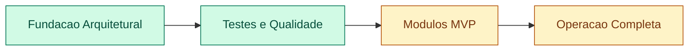
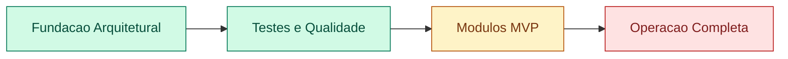

# GARFOU - Status de Aderencia ao Prompt Mestre

## Objetivo deste documento

Consolidar o estado real do projeto para continuidade por agentes de IA sem retrabalho.

## Referencias de continuidade (specs vivas)

- docs/specs/master-spec.md
- docs/specs/todo.md
- docs/specs/progress-log.md

## Resumo executivo

- Base arquitetural pronta e coerente com Vercel FREE
- Multitenancy, RBAC e rate limiting implementados
- Módulo de pedidos: ciclo completo operacional incluindo modal de detalhe, impressão térmica
  (Bematech MP-4200 58mm) e widget de ações rápidas no dashboard
- Testes automatizados ativos com cobertura global acima da meta
- Ainda existem lacunas de feature-complete para operação de restaurante real

## Matriz de aderencia

| Area                                            | Status       | Evidencias                                                    |
| ----------------------------------------------- | ------------ | ------------------------------------------------------------- |
| Next.js + TS + App Router                       | Concluido    | src/app, package.json                                         |
| Tailwind + shadcn/ui + lucide                   | Concluido    | src/components/ui, dependencias                               |
| Prisma + PostgreSQL                             | Concluido    | prisma/schema.prisma, docs/database/schema.md                 |
| Vercel FREE friendly                            | Concluido    | docs/deploy/vercel.md, polling em realtime                    |
| Realtime sem websocket persistente              | Concluido    | docs/realtime/strategy.md, kitchen polling 3s                 |
| Multitenancy (single DB + isolamento)           | Concluido    | docs/multi-tenancy/strategy.md, repositories com restaurantId |
| RBAC + seguranca baseline                       | Concluido    | src/lib/rbac.ts, docs/architecture/security.md                |
| Rate limit endpoints publicos                   | Concluido    | src/lib/rate-limit.ts, rotas register/orders/nps              |
| Testes unitarios/integracao base                | Concluido    | 115 testes passando                                           |
| Cobertura minima 80%                            | Concluido    | 86.88% statements                                             |
| E2E Playwright                                  | Parcial      | infra criada, estabilizacao de cenarios pendente              |
| Impressao termica no browser (58mm)             | Concluido    | src/features/orders/order-print-receipt.tsx                   |
| Modal de detalhe de pedido                      | Concluido    | src/features/orders/order-detail-modal.tsx                    |
| Dashboard widget de pedidos pendentes           | Concluido    | src/features/orders/dashboard-pending-orders.tsx              |
| Print Agent local (daemon/electron)             | Nao iniciado | apenas arquitetura documentada                                |
| Fluxo WhatsApp completo                         | Nao iniciado | sem envio automatizado, apenas diretriz                       |
| Operacao completa de entrega (bairro/raio/taxa) | Parcial      | estrutura existe, regras completas pendentes                  |
| Horario de funcionamento automatico             | Parcial      | suporte parcial no dominio                                    |
| Stripe assinatura fim a fim                     | Parcial      | base de stripe existente, ciclo completo pendente             |
| Storybook ou rota dev/components                | Concluido    | src/app/dev/components/page.tsx                               |

## Estado dos modulos de negocio

| Modulo                            | Estado atual                                                                          |
| --------------------------------- | ------------------------------------------------------------------------------------- |
| Pedidos                           | Funcional completo — ciclo, modal de detalhe, impressão 58mm, ações rápidas dashboard |
| Cardapio digital                  | Funcional (publico + interno)                                                         |
| App do garcom                     | Funcional base (pedido rapido)                                                        |
| Tela de cozinha                   | Funcional base com polling e atualizacao de status                                    |
| Financeiro                        | Funcional base                                                                        |
| Estoque                           | Funcional base                                                                        |
| CRM                               | Parcial                                                                               |
| Relatorios                        | Parcial                                                                               |
| Cupons                            | Parcial                                                                               |
| NPS                               | Funcional base                                                                        |
| Impressao termica local (browser) | Concluido — iframe + window.print() com @page 58mm                                    |
| Print Agent daemon (local)        | Arquitetura pronta, implementacao pendente                                            |

## Arquivos chave do modulo de pedidos

| Arquivo                                                            | Responsabilidade                                                                                |
| ------------------------------------------------------------------ | ----------------------------------------------------------------------------------------------- |
| `src/features/orders/orders-live-table.tsx`                        | Tabela com polling 5s, filtros de status, Eye button em toda linha, ✅/❌ inline para pendentes |
| `src/features/orders/order-detail-modal.tsx`                       | Dialog acessível, receipt preview, Confirmar+Imprimir, Recusar                                  |
| `src/features/orders/order-print-receipt.tsx`                      | Builder 48-col, `printOrder()` (iframe 58mm), preview de tela                                   |
| `src/features/orders/dashboard-pending-orders.tsx`                 | Widget polling 8s, até 5 pendentes, Eye + Confirm quick-actions                                 |
| `src/features/orders/dashboard-new-order-alert.tsx`                | Legado — alerta simples de novos pedidos (mantido mas não usado no dashboard principal)         |
| `src/repositories/order.repository.ts`                             | `findMany()` retorna items[] completo; `findById()` retorna order com customer+items+addons     |
| `src/app/api/restaurants/[restaurantId]/orders/[orderId]/route.ts` | GET (detalhe) + PATCH (status)                                                                  |

## Linha de base de qualidade

- Testes: 115 passando
- Build: compilando sem regressao
- Cobertura statements: 86.88%
- Cobertura branches: 75.72%
- Cobertura functions: 77.77%
- Cobertura lines: 87.17%

## Riscos atuais

1. Ausencia de Print Agent real impede automacao de impressao em ambiente de pico.
2. E2E ainda nao estabilizado para fluxo completo de operacao.
3. Alguns modulos estao em nivel MVP e nao em nivel operacao completa.
4. `DashboardNewOrderAlert` mantido no codebase mas não utilizado — pode ser removido futuramente.

## Proximas entregas recomendadas

1. Implementar Print Agent local (Node daemon) com fila e confirmacao de impressao.
2. Finalizar fluxos E2E criticos: signup -> onboarding -> pedido -> cozinha -> finalizacao.
3. Elevar cobertura de branches/functions em order service e utils.
4. Fechar lacunas de entrega, cupons e horario automatico com regras completas.
5. Manter os arquivos em docs/specs/ atualizados a cada ciclo de implementacao.

## Diagrama de status

## Objetivo deste documento

Consolidar o estado real do projeto para continuidade por agentes de IA sem retrabalho.

## Referencias de continuidade (specs vivas)

- docs/specs/master-spec.md
- docs/specs/todo.md
- docs/specs/progress-log.md

## Resumo executivo

- Base arquitetural pronta e coerente com Vercel FREE
- Multitenancy, RBAC e rate limiting implementados
- Modulos principais em estagio misto (alguns operacionais, outros parciais)
- Testes automatizados ativos com cobertura global acima da meta
- Ainda existem lacunas de feature-complete para operacao de restaurante real

## Matriz de aderencia

| Area                                            | Status       | Evidencias                                                    |
| ----------------------------------------------- | ------------ | ------------------------------------------------------------- |
| Next.js + TS + App Router                       | Concluido    | src/app, package.json                                         |
| Tailwind + shadcn/ui + lucide                   | Concluido    | src/components/ui, dependencias                               |
| Prisma + PostgreSQL                             | Concluido    | prisma/schema.prisma, docs/database/schema.md                 |
| Vercel FREE friendly                            | Concluido    | docs/deploy/vercel.md, polling em realtime                    |
| Realtime sem websocket persistente              | Concluido    | docs/realtime/strategy.md, kitchen polling 3s                 |
| Multitenancy (single DB + isolamento)           | Concluido    | docs/multi-tenancy/strategy.md, repositories com restaurantId |
| RBAC + seguranca baseline                       | Concluido    | src/lib/rbac.ts, docs/architecture/security.md                |
| Rate limit endpoints publicos                   | Concluido    | src/lib/rate-limit.ts, rotas register/orders/nps              |
| Testes unitarios/integracao base                | Concluido    | 115 testes passando                                           |
| Cobertura minima 80%                            | Concluido    | 86.88% statements                                             |
| E2E Playwright                                  | Parcial      | infra criada, estabilizacao de cenarios pendente              |
| Print Agent local (daemon/electron)             | Nao iniciado | apenas arquitetura documentada                                |
| Fluxo WhatsApp completo                         | Nao iniciado | sem envio automatizado, apenas diretriz                       |
| Operacao completa de entrega (bairro/raio/taxa) | Parcial      | estrutura existe, regras completas pendentes                  |
| Horario de funcionamento automatico             | Parcial      | suporte parcial no dominio                                    |
| Stripe assinatura fim a fim                     | Parcial      | base de stripe existente, ciclo completo pendente             |
| Storybook ou rota dev/components                | Concluido    | src/app/dev/components/page.tsx                               |

## Estado dos modulos de negocio

| Modulo                  | Estado atual                                        |
| ----------------------- | --------------------------------------------------- |
| Pedidos                 | Funcional com ciclo principal e controles de status |
| Cardapio digital        | Funcional (publico + interno)                       |
| App do garcom           | Funcional base (pedido rapido)                      |
| Tela de cozinha         | Funcional base com polling e atualizacao de status  |
| Financeiro              | Funcional base                                      |
| Estoque                 | Funcional base                                      |
| CRM                     | Parcial                                             |
| Relatorios              | Parcial                                             |
| Cupons                  | Parcial                                             |
| NPS                     | Funcional base                                      |
| Impressao termica local | Arquitetura pronta, implementacao pendente          |

## Linha de base de qualidade

- Testes: 115 passando
- Build: compilando sem regressao
- Cobertura statements: 86.88%
- Cobertura branches: 75.72%
- Cobertura functions: 77.77%
- Cobertura lines: 87.17%

## Riscos atuais

1. Ausencia de Print Agent real impede automacao de impressao em ambiente de pico.
2. E2E ainda nao estabilizado para fluxo completo de operacao.
3. Alguns modulos estao em nivel MVP e nao em nivel operacao completa.

## Proximas entregas recomendadas

1. Implementar Print Agent local (Node daemon) com fila e confirmacao de impressao.
2. Finalizar fluxos E2E criticos: signup -> onboarding -> pedido -> cozinha -> finalizacao.
3. Elevar cobertura de branches/functions em order service e utils.
4. Fechar lacunas de entrega, cupons e horario automatico com regras completas.
5. Manter os arquivos em docs/specs/ atualizados a cada ciclo de implementacao.

## Diagrama de status

