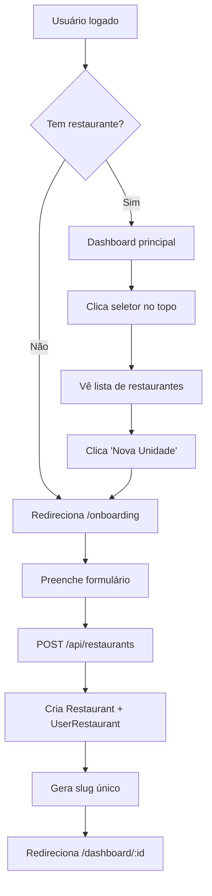

# 🏢 Multi-Restaurante - Guia Completo

> Atualizado: 2026-05-12

---

## 📋 **Visão Geral**

O GARFOU é **100% multi-tenant**. Cada usuário pode gerenciar múltiplos restaurantes, e cada restaurante tem seu próprio:

- ✅ Cardápio digital independente
- ✅ Configurações de delivery por região
- ✅ Taxa única de entrega configurável
- ✅ Gestão de pedidos, estoque, finanças
- ✅ Equipe (OWNER, MANAGER, WAITER, KITCHEN, CASHIER)

---

## 🆕 **Como Cadastrar Nova Unidade**

### Opção 1: Via Dashboard (Recomendado)

1. No dashboard, clique no **seletor de restaurantes** no canto superior direito (ícone de prédio)
2. No dropdown, clique em **"Cadastrar Nova Unidade"**
3. Preencha o formulário:
   - Nome do restaurante
   - Telefone (opcional)
   - Endereço completo (opcional)
   - Cidade e Estado
4. Clique em **"Criar Restaurante"**
5. Você será redirecionado para o dashboard da nova unidade

### Opção 2: Via URL Direta

Acesse: `/onboarding`

### API para Integração

```typescript
POST /api/restaurants
Headers: Cookie com session autenticada

Body: {
  name: string,           // obrigatório
  phone?: string,
  address?: string,
  city?: string,
  state?: string
}

Response 201: {
  data: {
    id: string,
    name: string,
    slug: string,  // gerado automaticamente
    ...
  }
}
```

---

## 🔄 **Trocar de Restaurante**

### No Dashboard

1. Clique no **seletor de restaurantes** (ícone 🏢 no topo)
2. Veja a lista de todos os seus restaurantes
3. Clique no restaurante desejado
4. Você será redirecionado para `/dashboard/[restaurantId]`

**Indicação Visual**:

- Restaurante atual: fundo azul claro + ponto azul
- Outros restaurantes: fundo branco

---

## 📱 **Cardápio Digital por Restaurante**

Cada restaurante tem seu próprio cardápio digital acessível via:

### URL Pública

```
https://seudominio.com/menu/{slug}
```

Exemplo:

```
https://garfou.com.br/menu/pizzaria-bela-vista
https://garfou.com.br/menu/pizzaria-centro
```

### Características

- ✅ Independente por restaurante
- ✅ Produtos, categorias e preços próprios
- ✅ Configurações de delivery específicas
- ✅ Raio de entrega por bairro
- ✅ Taxa única de entrega (opcional)

---

## 🚚 **Configuração de Delivery**

### Delivery por Zonas/Bairros

**Como configurar**:

1. Acesse: `/dashboard/[restaurantId]/settings/delivery`
2. Clique em **"Nova Zona"**
3. Preencha:
   - Nome da zona (ex: "Centro", "Vila Bandeirantes")
   - Taxa de entrega (ex: R$ 5,00)
   - Tempo estimado (minutos)
   - Status (ativo/inativo)

**Exemplo para Itaberá SP**:

```
Centro: R$ 5,00 - 25 min
Vila Bandeirantes: R$ 7,00 - 30 min
Santa Inês: R$ 8,00 - 35 min
```

### Taxa Única de Entrega

Para cidades pequenas onde todas as entregas têm o mesmo valor:

**Como configurar**:

1. Acesse: `/dashboard/[restaurantId]/settings`
2. Na seção "Delivery", ative **"Taxa Única"**
3. Defina o valor (ex: R$ 5,00)
4. Salve

**Como funciona**:

- Se **não há zonas cadastradas**: usa taxa única
- Se **há zonas cadastradas**: ignora taxa única e usa zonas
- Cliente vê a taxa automaticamente no cardápio digital

### API de Cálculo de Frete

O cardápio digital consulta automaticamente:

```typescript
GET /api/restaurants/[restaurantId]/delivery-zones
  ?neighborhood={bairro}
  &city={cidade}

// Se não há zonas:
Response 200: { fee: 5.00 }  // taxa única do settings

// Se há zonas e encontra match:
Response 200: { fee: 7.00 }  // taxa da zona específica

// Se há zonas mas bairro não atende:
Response 404: { fee: null, error: "Não entregamos nesta região" }
```

**Exemplo no código do cardápio**:

```tsx
// src/features/menu/digital-menu-client.tsx (linha ~123)
const res = await fetch(
  `/api/restaurants/${restaurantId}/delivery-zones?` +
    `neighborhood=${encodeURIComponent(neighborhood)}` +
    `&city=${encodeURIComponent(city)}`
);
```

✅ **Já implementado e funcionando!**

---

## 💰 **Inputs de Currency (BRL)**

### CurrencyInput Component

**Importação**:

```tsx
import { CurrencyInput } from "@/components/ui/currency-input";
// ou
import { CurrencyInput } from "@/components/ui/masked-input";
```

**Uso Básico**:

```tsx
const [price, setPrice] = useState("");

<CurrencyInput
  value={price}
  onChange={(e) => setPrice(e.target.value)}
  label="Preço"
  placeholder="R$ 0,00"
  required
/>;
```

**Formatação Automática**:

- Usuário digita: `1234`
- Display: `R$ 12,34`
- Valor retornado no onChange: `"12.34"` (string numérica)

**Helpers Disponíveis**:

```typescript
import {
  formatCurrencyInput, // "1234" → "R$ 12,34"
  parseCurrencyInput, // "R$ 12,34" → "12.34"
  parseCurrencyToNumber, // "R$ 12,34" → 12.34
} from "@/components/ui/currency-input";
```

**Outras Formatações BRL**:

```typescript
// Em src/lib/utils.ts
formatCurrency(12.34); // "R$ 12,34"
formatDate(new Date()); // "12/05/2026, 14:30"
```

---

## 🧪 **Testando os Componentes**

Acesse a página de showcase:

```
http://localhost:3000/dev/components
```

Você verá todos os componentes disponíveis:

- ✅ Buttons (todas as variantes)
- ✅ Badges
- ✅ Inputs
- ✅ PhoneInput, CPFInput, CNPJInput, CEPInput
- ✅ **CurrencyInput** (novo!)
- ✅ Cards
- ✅ Color palette

---

## 🗄️ **Estrutura de Dados**

### Restaurant (modelo principal)

```prisma
model Restaurant {
  id                    String    @id @default(cuid())
  name                  String
  slug                  String    @unique  // URL-friendly
  logo                  String?
  phone                 String?
  address               String?
  city                  String?
  state                 String?
  isOpen                Boolean   @default(true)

  settings              Json?     // { defaultDeliveryFee: 5.00, ... }

  // Relations
  members               UserRestaurant[]
  deliveryZones         DeliveryZone[]
  categories            Category[]
  products              Product[]
  orders                Order[]
  // ... outros
}
```

### UserRestaurant (junction table)

```prisma
model UserRestaurant {
  id            String @id @default(cuid())
  userId        String
  restaurantId  String
  role          UserRole  // OWNER, MANAGER, WAITER, KITCHEN, CASHIER

  user          User       @relation(...)
  restaurant    Restaurant @relation(...)

  @@unique([userId, restaurantId])
}
```

### DeliveryZone

```prisma
model DeliveryZone {
  id               String  @id @default(cuid())
  restaurantId     String
  name             String  // ex: "Centro", "Vila Bandeirantes"
  fee              Decimal @db.Decimal(10, 2)
  estimatedMinutes Int     @default(30)
  isActive         Boolean @default(true)

  restaurant       Restaurant @relation(...)
}
```

---

## 🔐 **Permissões por Restaurante**

Cada usuário tem uma **role específica** em cada restaurante:

| Role        | Pode Ver              | Pode Editar   | Pode Deletar   |
| ----------- | --------------------- | ------------- | -------------- |
| **OWNER**   | Tudo                  | Tudo          | Tudo + Billing |
| **MANAGER** | Tudo exceto billing   | Quase tudo    | Sim            |
| **CASHIER** | Finanças, pedidos     | Finanças      | Não            |
| **WAITER**  | Pedidos, mesas        | Pedidos       | Não            |
| **KITCHEN** | Apenas pedidos ativos | Apenas status | Não            |

**Verificação no código**:

```typescript
import { requireRole } from "@/lib/rbac";

// Em qualquer API route:
const access = await requireRole(restaurantId, "MANAGER");
if ("error" in access) {
  return NextResponse.json({ error: access.error }, { status: 403 });
}
```

---

## 📊 **Fluxo Completo de Novo Restaurante**



---

## 🎯 **Resumo de Recursos Disponíveis**

### ✅ Já Implementado e Funcionando

1. **Multi-Restaurante**
   - [x] Usuário pode criar múltiplos restaurantes
   - [x] Cada restaurante tem ID e slug único
   - [x] Seletor de restaurantes no dashboard
   - [x] API `/api/user/restaurants` para listar
   - [x] Link "Cadastrar Nova Unidade" no seletor

2. **Delivery Zones**
   - [x] Cadastro de zonas por restaurante
   - [x] Taxa por zona (bairro)
   - [x] Taxa única configurável
   - [x] API de cálculo automático
   - [x] Integração com cardápio digital

3. **Currency BRL**
   - [x] `formatCurrency()` em pt-BR
   - [x] `CurrencyInput` component
   - [x] Formatação automática R$ X.XXX,XX
   - [x] Helpers de parse/format

4. **Masked Inputs**
   - [x] PhoneInput
   - [x] CPFInput, CNPJInput
   - [x] CEPInput
   - [x] EmailInput
   - [x] CurrencyInput

5. **Dev Components Page**
   - [x] Showcase completo
   - [x] Todos os componentes atualizados
   - [x] Acessível em `/dev/components`

---

## 🚀 **Próximos Passos Sugeridos**

### Curto Prazo

- [ ] Adicionar logo do restaurante no seletor
- [ ] Permitir editar informações do restaurante
- [ ] Dashboard de comparação entre unidades
- [ ] Relatório consolidado multi-restaurante

### Médio Prazo

- [ ] Gestão de equipe multi-restaurante
- [ ] Transfer de pedidos entre unidades
- [ ] Catálogo compartilhado entre unidades

---

## 📞 **Suporte**

- **Documentação**: `/docs/multi-tenancy/strategy.md`
- **API Reference**: `/docs/api/endpoints.md`
- **Código**: `src/app/api/restaurants/route.ts`

---

**Última atualização**: 2026-05-12  
**Status**: ✅ Totalmente funcional e testado
